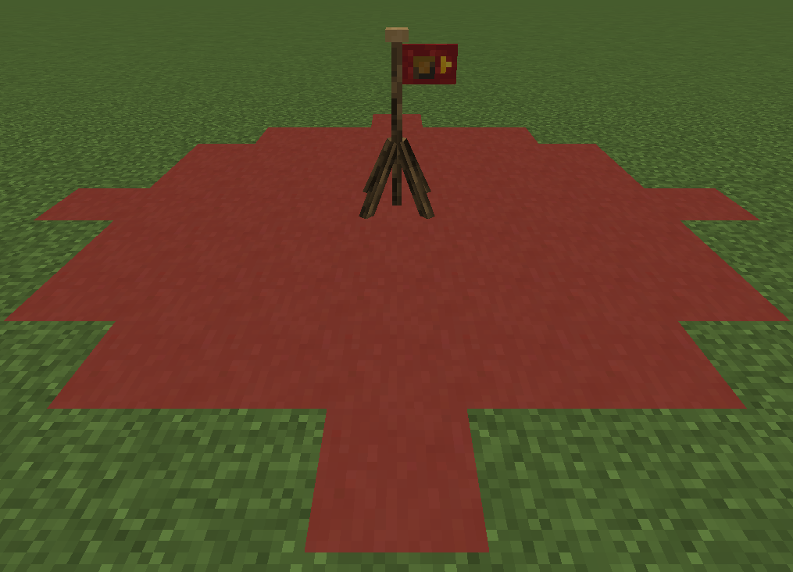

# Advanced Caravans

Adds a new entity that will lead caravans of llamas across your world to move a ton of items from one place to another.

## How to use
1. find a caravan leader in a village
2. Buy a source and dest item from it
3. Place the source item where you want the items to be moved from
4. Place the dest item where you want the items to be moved to

Any chest placed in the source or target's range will be taken from or deposited to.
A visualisation of the range is shown in the image below, any block with inventory placed on the red blocks will be in range.

### Advanced features

Llamas will only follow llamas with the same colour carpet as the leader. 
A leader without carpet is considered to be a leader of all colours.

The source and dest blocks react to redstone, while powered they will always be enabled even when there are no items or no space is available.

